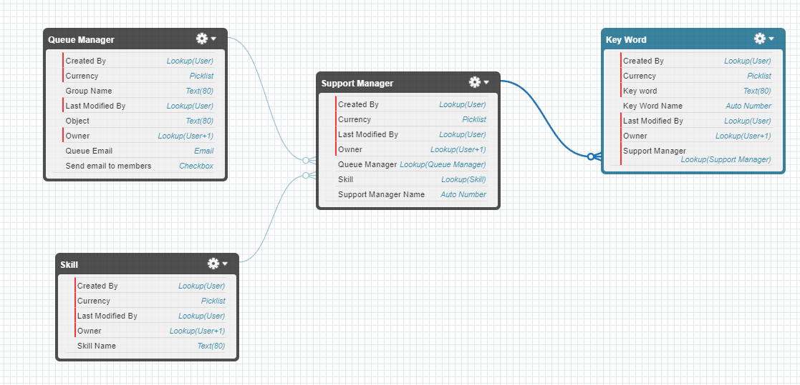

# Email Service Template 📬

This project is build to help to implemetation Email Service Salesforce how alternative to email-to-case, give for developer more control about inbound emails.

## Features 🔥

- Create case based in threadId in body or subject email
- Create files to email
- Adjust SRC images inside email body
- Search contact based on from email
- Send case to queue or skill based on key word

## How to use this? 🪧

1. Clone this repository
2. Deploy to your org
3. Configure Queue/Skill object
4. Configure email template to use auto-response (in developement) 🚧
5. Enable auto-response in custom metadata type (in developement) 🚧

## Next steps 🪜

- [x] Allow search for keyword inside body or subject and redirect to queue or skill
- [x] Fix test class
- [] Allow auto-response inside service to customer
- [x] Search for keyword inside body or subject and redirect to queue or skill
- [] Refactoing using design pattern - Clean Code.

## Objects UML Diagram 🖼️

## More information ℹ️

- [Email Service Documentation](https://help.salesforce.com/s/articleView?id=sf.code_email_services.htm&language=en_US&type=5)
- [Apex Email Service Documentation](https://developer.salesforce.com/docs/atlas.en-us.apexcode.meta/apexcode/apex_classes_email_inbound_what_is.htm)

## Can you contribute for this template? 🆘

- Open a PR 😀
